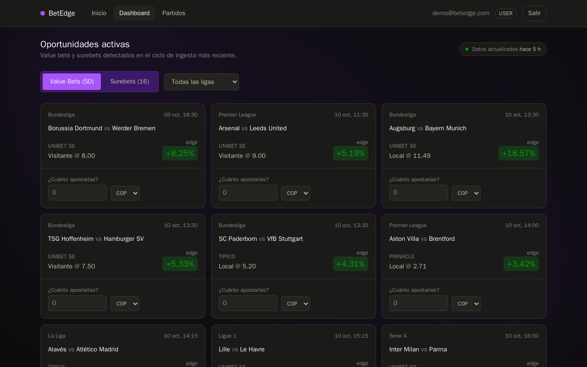
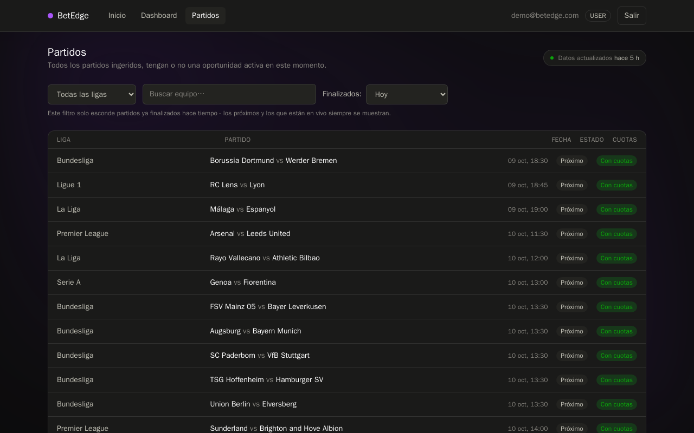
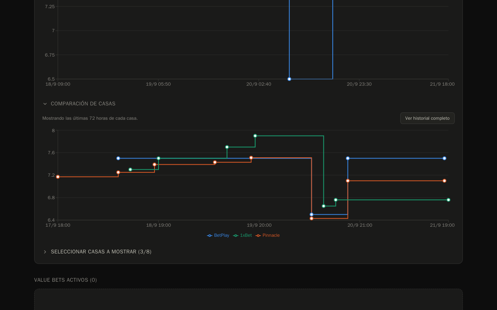
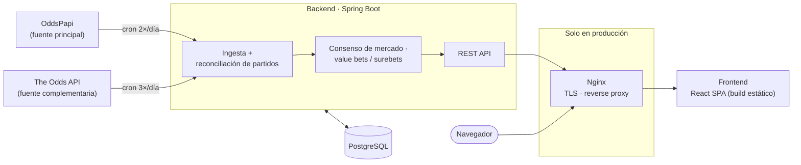

# BetEdge

Detecta automáticamente **value bets** y **surebets** en fútbol, cruzando las cuotas de dos proveedores independientes para calcular un consenso de mercado en tiempo real.

**🔴 En vivo: [betedge-jdm.duckdns.org](https://betedge-jdm.duckdns.org)** — cuenta demo precargada en el login (`demo@betedge.com` / `Demo1234!`), sin registro necesario.

---

## Qué es BetEdge

Las casas de apuestas no publican la probabilidad real de un resultado — publican una cuota, y esa cuota ya trae incluido el margen de ganancia de la casa. BetEdge le quita ese margen a cada casa de referencia, promedia las probabilidades limpias resultantes entre todas, y así estima cuál es la probabilidad real del mercado para cada resultado (local, empate, visitante). Ese promedio es el **consenso**.

Con el consenso ya calculado, comparar cada cuota individual contra él es directo. Cuando una casa específica ofrece una cuota mejor de lo que el consenso dice que debería valer, esa diferencia es el **edge** de un *value bet*: una apuesta con expectativa matemática a favor, no una ganancia garantizada — depende de que el consenso tenga razón. Un *surebet* es distinto: combinando las mejores cuotas de casas distintas para cada resultado posible, a veces lo que hay que apostar en cada una suma menos del 100%. Repartiendo el dinero entre las tres, la ganancia queda garantizada sin importar el resultado real del partido.

El sistema ingiere cuotas de **OddsPapi** (fuente principal) y **The Odds API** (fuente complementaria) para seis ligas — Premier League, La Liga, Serie A, Bundesliga, Ligue 1 y Champions League —, reconcilia el mismo partido real visto por ambas fuentes en una sola entidad, recalcula el consenso en cada ciclo de ingesta, y guarda el historial completo de cada cuota por casa de apuestas para poder ver cómo se movió el mercado antes del pitazo inicial.

## Capturas

**Dashboard** — oportunidades activas (value bets y surebets), con calculadora de stake por tarjeta:



**Partidos** — todos los partidos ingeridos, con filtro por liga, búsqueda y ventana de finalizados:



**Detalle de partido** — evolución de cuotas por casa, comparación entre varias casas a la vez:



Las tres son capturas reales del sitio en producción (Playwright headless, cuenta demo), no mockups.

## Arquitectura



En desarrollo el frontend habla directo con el backend (dos orígenes, CORS); en producción Nginx sirve el build estático y reenvía `/api/*` al backend por la red interna de Docker — el backend nunca queda expuesto directamente.

## Stack técnico

| Capa | Tecnologías |
|---|---|
| **Backend** | Java 21 · Spring Boot 4.1 (Spring Security, Spring Data JPA, Spring RestClient) · PostgreSQL 16 · Flyway · JJWT · Google API Client (verificación de ID tokens) |
| **Frontend** | React 19 · TypeScript · React Router 7 · Tailwind CSS 4 · Recharts · Vite 8 |
| **Infraestructura** | Docker + Docker Compose · Nginx (reverse proxy + TLS) · Let's Encrypt / Certbot (renovación automática) · Oracle Cloud (Ampere/ARM) |

## Retos técnicos

**Reconciliar el mismo partido visto por dos proveedores.** OddsPapi y The Odds API no comparten ningún ID en común — cada uno reporta el mismo partido real con su propio identificador y, muchas veces, con el nombre del equipo escrito distinto ("Arsenal" vs "Arsenal FC", con o sin tildes, abreviaturas regionales). `MatchReconciliationService` normaliza nombres (sufijos organizacionales, prefijos, guiones/ampersands, hasta una tabla de alias explícita para casos de idioma genuino como "Köln"/"Cologne") y solo fusiona cuando exactamente un candidato cumple nombre *y* horario de inicio — cero candidatos o más de uno se dejan sin fusionar a propósito, porque una fusión equivocada es mucho peor que una fusión perdida.

**Un bug real de deduplicación con una sola casa dual-fuente.** Pinnacle llegaba tanto por OddsPapi como por The Odds API bajo el mismo `bookmaker_id`. La deduplicación original comparaba cada precio nuevo contra "la última fila registrada, sin importar la fuente" — así que cuando las dos fuentes intercalaban sus propios reportes (cada uno estable pero distinto entre sí), cada una veía el reporte de la otra como si el precio hubiera cambiado, e insertaba una fila nueva en cada ciclo aunque su propio precio nunca se hubiera movido. Se corrigió comparando cada fuente solo contra su propio historial, y estructuralmente quitando a Pinnacle de una de las dos fuentes para que el problema no pueda reaparecer.

**Reducir 91–98% los round-trips a Postgres durante la ingesta.** La primera versión de la ingesta consultaba la base de datos una vez por cada precio a deduplicar y una vez por cada bookmaker visto en cada evento — miles de queries individuales por corrida. Se reemplazó por una carga por lotes (una sola query trae el último precio conocido de todo un partido; una sola query cachea todos los bookmakers de la corrida). Medido en vivo: de 1.152 a 98 round-trips en la ingesta de OddsPapi (**-91,5%**) y de 6.384 a 103 en la de The Odds API (**-98,4%**), sin cambiar el resultado final.

**Protegerse de quedarse sin cupo de API a mitad de mes.** El plan gratuito de OddsPapi no confirma si su límite mensual se reinicia o es de por vida, así que agotarlo sería permanente. El backend consulta `GET /account` (gratis, no gastado el cupo del plan) antes de cada corrida programada; si el cupo restante cae debajo de un colchón configurable, la corrida se salta por completo en vez de arriesgarse a que cada llamada real falle a mitad de camino — y el resultado queda registrado para poder ver la tendencia de consumo en el tiempo, no solo enterarse cuando ya es tarde.

## Cómo correrlo en local

Necesitás Java 21, Node 20.19+ o 22.12+ (requisito real de Vite 8; en desarrollo usamos Node 25), Docker, y cuentas gratuitas en [OddsPapi](https://oddspapi.io) y [The Odds API](https://the-odds-api.com) (el backend no arranca sin *algún* valor en esas dos variables, aunque sea un placeholder — solo hace falta una key real si querés ingesta real de datos).

```bash
git clone https://github.com/jdmoralesvelandia/Betedge.git
cd Betedge

# 1. Base de datos (solo Postgres - backend y frontend corren nativos, no en Docker, en dev)
cd betedge
docker compose up -d

# 2. Backend
cp .env.example .env
# Editar .env: ODDSPAPI_API_KEY / THEODDSAPI_API_KEY (reales o un placeholder)
./mvnw spring-boot:run
# -> http://localhost:8080

# 3. Frontend (en otra terminal)
cd ../frontend
npm install
npm run dev
# -> http://localhost:5173
```

Con eso ya podés entrar con la cuenta demo (`demo@betedge.com` / `Demo1234!`) — funciona siempre, sin configuración adicional. El botón de Google usa un Client ID ya incluido en el repo (no es secreto, un Client ID de Google es seguro en código cliente por diseño), pero si no está autorizado para el origen desde el que estás corriendo el frontend, Google lo va a rechazar — no depende de nada que puedas arreglar vos localmente; usá la cuenta demo en ese caso. Los schedulers de ingesta arrancan apagados por defecto (`ODDS_INGESTION_SCHEDULING_ENABLED`, etc. en `.env.example`); para ver datos reales sin esperar al cron, el panel de Admin tiene un botón de disparo manual por proveedor. Ninguna migración siembra una cuenta `ADMIN` — se crea una sola vez llamando al endpoint de bootstrap con el secreto de tu `.env`:

```bash
curl -X POST http://localhost:8080/auth/bootstrap-admin \
  -H "Content-Type: application/json" \
  -H "X-Bootstrap-Secret: <el valor de ADMIN_BOOTSTRAP_SECRET en tu .env>" \
  -d '{"email":"admin@local.dev","password":"lo-que-quieras-min-8-caracteres"}'
```

Tests: `./mvnw test` (backend), `npm run lint` (frontend, vía oxlint).

## Licencia / uso

Código publicado para fines de evaluación de portafolio — sin licencia de uso comercial. Si te interesa usarlo o adaptarlo para otra cosa, [abrí un issue](https://github.com/jdmoralesvelandia/Betedge/issues) o contactame primero.
